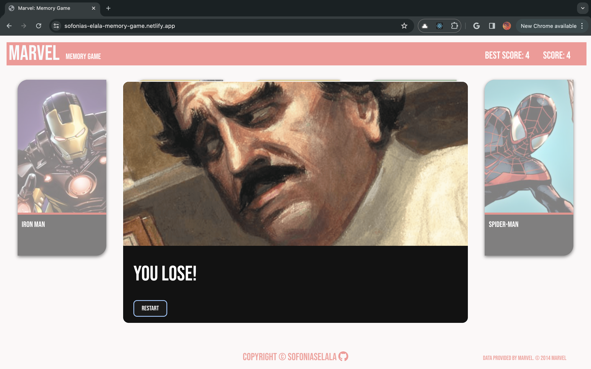
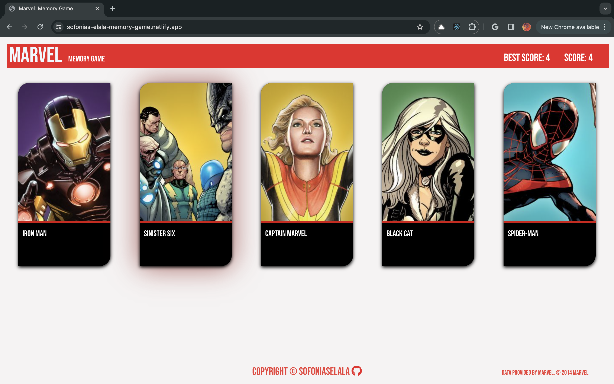

# Marvel: Memory Game
 
## Description
### This react game is a memory game for marvel characters. Click on characters that have not been clicked on in the current round and win the game. Its also mobile friendly. 

## Screenshots

## screenshots - mobile

## Technologies Used:

  * REACT + Vite
  * HTML5
  * CSS3
  * version control with Git/GitHub
  * Hosting on Netlify

## Dependencies
  * REACT + Vite
  * MARVEL API for the characters
  * eslint
